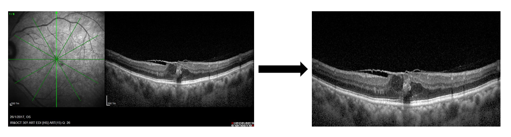
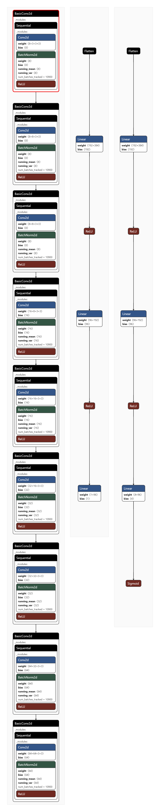
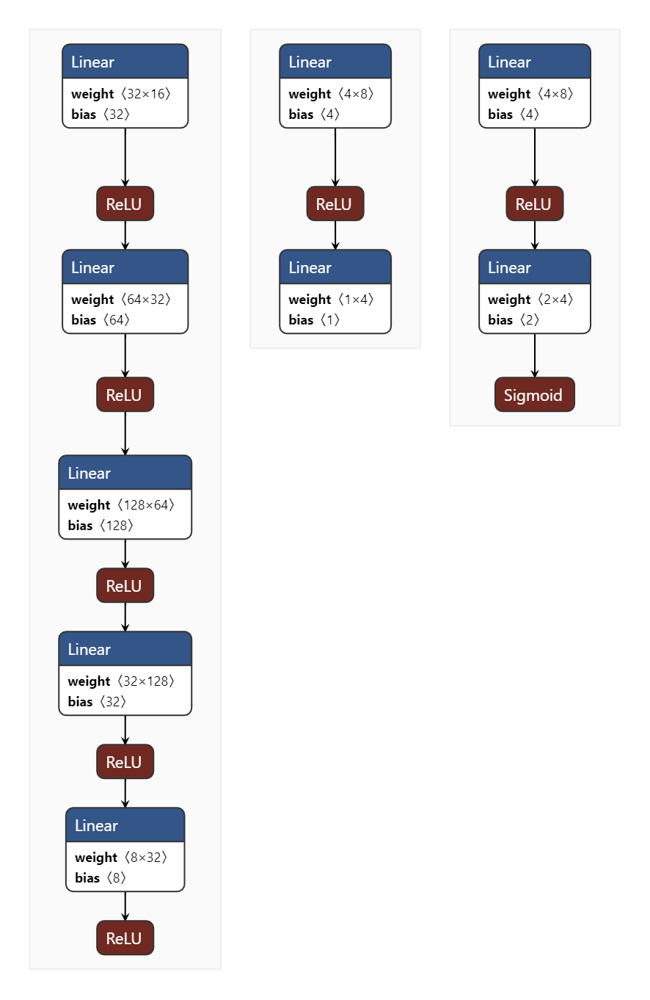
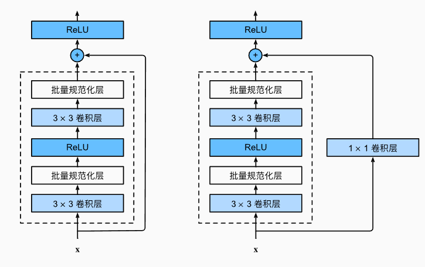
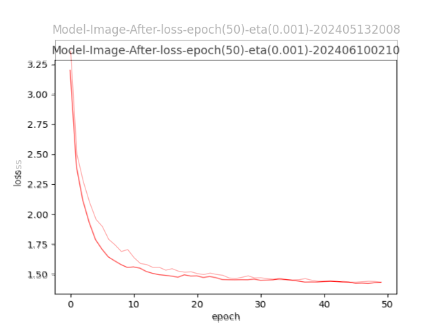

# APTOS2021 医学影像技术浅析

APTOS2021 是亚太远程眼科学会于 2021 年举办的眼科大数据比赛，致力于推动大数据发展及人工智能在眼科的应用。

## 项目介绍

Anti-VEGF 抗血管内皮生长因子治疗是一组可减少新生血管生长或肿胀的药物。Anti-VEGF 药物可用于治疗若干导致眼后视网膜黄斑区下新生血管生长或肿胀的眼部疾病。但是，有大量患者对这种疗法无反应或反应不充分。据不同研究报告，尽管每月接受 Anti-VEGF 注射治疗，仍有 10% 到 50% 不等的患者无反应或反应不充分。假如能在治疗前就确定无反应患者，并为其定制个性化治疗计划，这种状况就可以大为改观。  
在 APTOS2021 比赛中，需要建立机器学习模型来预测糖尿病性黄斑水肿(DME)患者对治疗的反应。将使用医院里收集的数千张影像，预测经过负荷治疗后，6 个月时对 Anti-VEGF 治疗的反应。如果成功，眼科医生就能借此定制治疗计划，并确保为患者提供及时有效的治疗。

数据集来源于 [阿里云天池](https://tianchi.aliyun.com/dataset/120006?t=1713341329807)

```
dataset.
├─test_info_stage1.csv
├─test_info_stage2.csv
├─train_anno_case_stage2.csv
├─train_anno_pic_stage2.csv
├─train_anno_stage1.csv
├─Train Set.zip
└─Validation Set.zip
```

其中图像存储在 Train Set.zip 与 Validation Set.zip 两个压缩包中，解压后的文件比较混乱，建议预先整理。

阿里云天池链接目前已经失效，可能是天池彻底关闭了比赛的通道。想获取数据可以使用该 [链接](https://asiateleophth-my.sharepoint.com/personal/secretariat_asiateleophth_org/_layouts/15/onedrive.aspx?id=%2Fpersonal%2Fsecretariat%5Fasiateleophth%5Forg%2FDocuments%2FAPTOS%202021%20Datasets%2FFinal%20Datasets&ga=1)

## 项目来源

本文基于该比赛排位第 29 名的参赛者于 Github 上分享的模型进行训练与分析。

> https://github.com/Zhenhui-Jin/Tianchi-APTOS

```
Tianchi-APTOS.
├─data
│  ├─processed
│  │  ├─csv
│  │  └─img
│  │      ├─test
│  │      └─train
│  ├─source
│  │  ├─final
│  │  │  ├─Test_Set
│  │  │  └─Train_Set
│  │  └─preliminary
│  │      ├─Test_set
│  │      └─Train_set
│  └─submit
├─model
│  ├─ckpt
│  │  ├─Model-CSV
│  │  └─Model-Image-After
│  └─result
├─processing
├─main.py
└─ ...
```

## 项目结构

项目采用了工程化的开发方式，将所有用到的文件路径全部定义在`config.py`文件中，根据该文件中变量的定义及注释，我们可以很方便分析出项目的结构：

### 数据集

`data` 文件夹存储与数据集相关的文件  
`source`文件夹存储经过手动整理的原始数据集，只需参考`config.py`中的注释，整理原始数据集，将初赛与决赛的训练集与验证集分别放入对应的目录即可  
`processed`文件夹存储预处理完毕的数据集，该部分不需要手动管理，在进行文件预处理时会自动生成  
`submit`文件夹中的文件仅在预测结果时读取过记录

```
 data
 ├─processed
 │  ├─csv
 │  └─img
 │      ├─test
 │      └─train
 ├─source
 │  ├─final
 │  │  ├─Test_Set
 │  │  └─Train_Set
 │  └─preliminary
 │      ├─Test_set
 │      └─Train_set
 └─submit
```

### 模型

`model`文件夹下存储与训练所使用的模型相关的文件  
`ckpt`存储每次训练保存的模型参数文件与训练过程中的 Loss 值变化图  
`result`文件夹存储每次的推测结果，由于该比赛已经结束，评分入口也已经关闭，因此目前已经无法评估推测结果的好坏

```
model
├─ckpt
│  ├─Model-CSV
│  └─Model-Image-After
└─result
```

### 预处理

`processing`文件夹存储预处理的相关方法，文件结构非常简单

## 项目入门

在运行文件前，需要安装好相关的依赖

```
pip install -r requirements.txt
```

项目的入口文件是根文件夹下的`main.py`，直接在 shell 中运行`python main.py`即可启动项目。启动后，可以看到项目提供了一些选项：

```
0 -> processing_data
1 -> train_image
2 -> train_csv
3 -> train_csv + train_image
4 -> predict_before_after
5 -> predict_all
```

项目采用了预处理与训练分离的方法，简而言之，就是在正式的训练开始之前，先对原始数据集进行处理，并直接将处理好的数据集保存到硬盘上

## 预处理

与预处理相关的方法全部存储在`/processing/data_factory.py`文件中
`_all_img_path_source`方法用于加载图像数据集，由于初赛与决赛的图像数据集格式不同，因此该方法调用了两个不同的函数用于处理初赛与决赛的数据集。方法的大致思路是，通过迭代与简单的判断读取所有的图像文件路径名（不读取图像文件本身），然后根据文件夹与文件本身的名字输出重命名后信息更加丰富的命名。  
`crop_img`函数调用了`read_image`与`write_image`两个方法。这两个函数的功能很好理解，即使用 opencv 库进行图像的读取与图像的创建，不过需要注意的是，`read_image`在读入图像时，对图像进行了裁剪，仅保留了原图像(50,550)到(450,1200)的部分，具体而言就是只保留了图像的右侧部分。  
`processing_data`集成调用了以上方法，完成图像数据集的预处理流程。



该文件中除了预处理相关的方法，还包含有`plot_log`，这一函数作用在于绘制图像并保存。该函数会在训练模型文件中得到调用。

## 训练

训练部分将从以下几点分析：

- 损失函数
- 网络结构
- 训练过程
- 预测过程

### 损失函数

损失函数包含在 `/model/loss.py` 文件中，包含`ImageLoss`与`CSVLoss`两个类，分别是处理图像与数据时使用的损失函数。  
图像的损失函数采用了均方误差损失（MSE）与带有逻辑回归的二元交叉熵损失（BCEWithLogits），最终值是二者的加权和，其中其中 BCEWithLogits 损失的权重是 2。  
数据的损失函数均方误差损失（MSE）和交叉熵损失（CrossEntropy），最终值也是二者的加权和，二者权重相等。  
所使用的损失函数均调用 pytorch 提供的接口。

### 网络结构

网络结构定义在文件`module.py`中。  
模型为简单的 CNN 卷积模型。模型首先定义了一个基本的卷积块，块的定义类似于 VGG，不过在其中去除了最大汇聚层，可能目的在于追求训练的效率。  
在图像的模型`ImageModule`中，原作者使用了 8 个这样基本的卷积块，再通过若干展平与线性回归操作得到结果。该模型提供了回归与分类的两个结果，区别在于最后通过的是线性模型还是`Sigmoid`函数。



数据的模型`CSVModule`比起图像而言就没有那么复杂，通过 5 层的线性模型与`ReLu`激励函数就能得出结果。与图像模型一样，回归结果与分类结果的模型略有不同。



网络结构的可视化使用 [netron](https://netron.app/) 生成。

### 训练过程

与模型相关的名字、训练次数、学习率等信息定义在`model_config.py`文件中，文件包含的变量将在训练过程中调用，这也是一种工程化的项目开发方式，大大方便了项目开发过程中参数的修改调整。
具体的训练过程代码处于`model.py`中。过程提供了两个模式，分别是训练模式与评估模式，二者训练的思路大致差不多，只在细微处存在区别。

> Pytorch 中训练与评估模式的区别：  
> 训练模式下模型参数会更新，而评估模式下模型参数保持不变，且 Dropout 层会被禁用，Batch Normalization 会固定使用移动平均值和方差。评估模式通常用于在每个训练周期结束后评估当前模型的性能，帮助调整超参数或提前停止训练。不过在本项目中，评估模式仅用于预测测试集。

过程首先要做的是加载数据集、模型与损失函数等，接着把这些移动到 GPU 上以加快训练速度（如果存在的话）。在做完准备工作后需要做的是定义优化器。本模型采用的优化器是 pytorch 提供的 Adam 优化器，较为常见与常用。  
然后，它开始训练循环，对每个批次的数据进行前向传播，计算损失，进行反向传播，然后更新模型参数。在每个 epoch 结束时，它会保存模型，并记录损失。  
在完成训练后，将调用`/processing/data_factory.py`中的方法来画图，记录训练中损失值的变化，以便对训练过程有一个直观的了解。

-eta(0.001)-202405132008.png>)

#### 预测过程

预测相关的方法保存在`/data/predict.py`中。预测采用模型的评估模式进行预测数据，其中大部分方法重点在于文件的读写，没有太多好说的。

## 改进尝试

对网络结构进行一些简单的替换。

残差神经网络由何恺明等人提出，在 2015 年的 ImageNet 图像识别挑战赛中一举夺魁，并深刻影响了后来的深度神经网络的设计。  
残差神经网络也由块构成，不过与 VGG 块不同的是，ResNet 块内拥有跨层数据通路，可以跳过这正常的卷积运算，将输入直接加在最后的激活函数前。  

将网络结构改为 Resnet 很简单，只需要在块内添加一个跨层数据通路即可，如下所示：

```
class ResidualBlock(nn.Module):
    def __init__(self, in_features, out_features, kernel_size: int = 3, stride: int = 1, dilation: int = 1):
        super().__init__()
        padding = (kernel_size - 1)
        self.conv1 = nn.Conv2d(in_features, out_features,
                               kernel_size=(kernel_size, kernel_size),
                               stride=(stride, stride),
                               padding=padding,
                               dilation=(dilation, dilation))
        self.bn1 = nn.BatchNorm2d(out_features)
        self.conv2 = nn.Conv2d(out_features, out_features,
                               kernel_size=3, stride=1, padding=1)
        self.bn2 = nn.BatchNorm2d(out_features)
        self.relu = nn.ReLU(inplace=True)
        self.shortcut = nn.Sequential()
        if stride != 1 or in_features != out_features:
            self.shortcut = nn.Sequential(
                nn.Conv2d(in_features, out_features, kernel_size=1,
                          stride=stride, bias=False),
                nn.BatchNorm2d(out_features)
            )

    def forward(self, x):
        out = self.relu(self.bn1(self.conv1(x)))
        out = self.bn2(self.conv2(out))
        out += self.shortcut(x)
        out = self.relu(out)
        return out
```

得到结果。

  
其中，颜色较深是 ResNet 的训练过程，可以看出，尽管 ResNet 在收敛速度上显著快于简单的多层 CNN 网络，不过在最后的结果上并没有取得比后者更低的损失。  
想要继续提升模型的精度，可能需要从预处理部分着手。

## 可能的思路

- 原作者在预处理图像时，直接将左半边裁除，只取右侧图像进行训练，这部分可以存在改进。如果将左半边也预处理好，对左半边的图像同样进行训练，再综合评估二者的结果，可能会有进展。
- 对于一个人的术前/术后的多个结果，原作者并没有做出区分，而是全部当作了独立的样本，如果对个人或者术前/术后的多个数据进行一些分类再进行训练，可能也会好一些。
